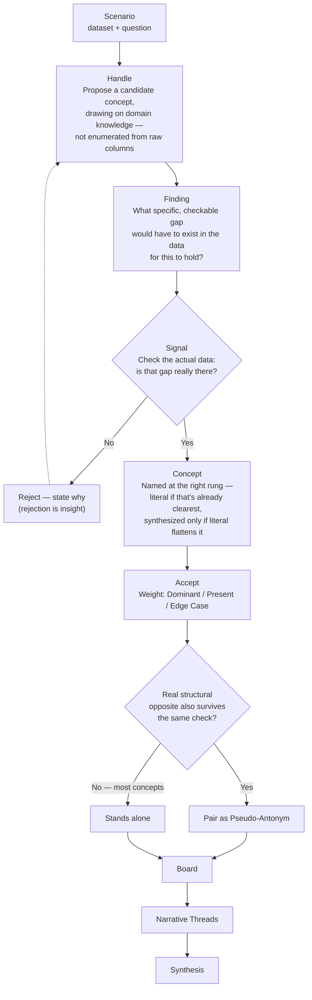

# THE DATA BOARD: OPEN METHODOLOGY v4.0

### "Given a good enough set of semantics — can we use language to represent data?"

Data has always needed an intermediary to reach human thought — visualization to make patterns visible, statistics to surface relationships. Both are bottom-up: numbers first, meaning second.

That wasn't always the order. For centuries, analysis began with language — reasoning, rhetoric, argument. Numbers-first analysis built up in waves: Taylorism reduced labor to measurable units in the early 1900s, the Cold War brought systems analysis and operations research, and Big Data made "let the numbers speak for themselves" an ideology. Each wave traded interpretability for scale.

LLMs are the first tool that can reverse that order without losing the rigor. Start with language, the way analysis used to work — but ground every claim in real evidence before it's allowed to stand.

---

## THE METHOD

A concept doesn't earn the board by sounding analytical. It earns the board by surviving a check.

1. **Propose** — a hypothesis drawn from domain knowledge, the way an analyst actually thinks, not enumerated from raw columns.
2. **Check** — does the data show the specific, checkable gap the hypothesis needs? Cite real values. Plausible isn't grounded.
3. **Reject or Name** — fails, reject it and say why (rejection is insight, not failure). Passes, name it at the right rung of abstraction, then weight it (Dominant / Present / Edge Case).
4. **Pair, conditionally** — a Pseudo-Antonym only if a real opposite survives the same check. Most concepts have none, and that's correct.
5. **Assemble** — the board forms from what's accepted.
6. **Thread** — independent of weight, which concepts carry one story together? That's a Narrative Thread, and that's where the deduction lives.



---

## THE THREE RUNGS OF ABSTRACTION

Every concept lives at one of three levels. Confusing them is the most common failure mode — flattening a real mechanism into a raw metric, or inflating a raw metric into jargon that explains nothing new.

| Rung | What it is | Example |
|---|---|---|
| **1 — Signal** | A raw field. No aboutness on its own. | `CTR` |
| **2 — Finding** | Signal + a real, checkable gap. Still just a fact. | "CTR is higher for travel-destination content" |
| **3 — Handle → Concept** | A *Handle* is the proposed name — not yet earned. It becomes a *Concept* once it survives the check: a mechanism that means more than the number that grounded it. | "Travel Destinations" |

**Calibrated naming cuts both ways.** Climb to a synthesized name only when the literal term would flatten a real mechanism — otherwise keep it. "Healthy Life Expectancy" needs no synthesis. "Resource Elasticity" earns its keep over "Income" because it names the gap between raw wealth and the freedom it buys. Jargon that explains nothing new is worse than the plain term it replaced.

---

## THE THREE PILLARS OF REASONING

| Pillar | Mechanism | What it's not |
|---|---|---|
| **Abstraction** | Calibrating the right rung for each handle — sometimes literal, sometimes climbing. | Not "maximize abstraction" — always climbing is the over-abstraction failure this framework exists to catch. |
| **Salience** | Traffic-light color (Dominant / Present / Edge Case) reads pre-attentively, before conscious attention. | Not a quantity — an ordinal category. The Sharpness score is the actual number. |
| **Narrative Cohesion** | Clustering concepts that share one story (Narrative Threads) — related items held together are easier to reason about than scattered. | Not statistical clustering. A single LLM judgment call, not an embedding or graph algorithm. |

---

## KEY CONCEPTS

**Deducible Space** — the minimal set of grounded, coherent, tension-bearing concepts from which a consistent narrative follows inevitably. Not a list of variables — the foundation that makes the narrative non-arbitrary.

**Pseudo-Antonyms** — concept pairs at opposite ends of the same analytical dimension. Not lexical opposites — two independently-grounded findings pulling in opposite directions on the same real axis. Conditional, not mandatory: most concepts have no natural opposite, and forcing one is exactly the failure this framework catches.

**Grounded Evidence** — a claim citing specific values from a real dataset the AI was actually given, not what merely sounds plausible for the domain. No dataset available → say so ("general domain knowledge, not data-verified"), don't invent a statistic.

**Verification Shift** — the AI moves from invention to verification once vocabulary is supplied: checking whether concepts are descriptive and grounded, not generating labels freely.

**Semantic Weight** — DOMINANT (primary driver) · PRESENT (real, not decisive) · EDGE CASE (marginal or structural outlier).

**Narrative Thread** — which concepts, together, actually carry one story, independent of how any single one is weighted. A concept can belong to more than one thread.

---

## EVALUATION MATRIX

* **GREEN (Dominant)** — descriptive, grounded, coherent. Drives the story.
* **YELLOW (Present)** — descriptive, grounded. Supplementary.
* **RED (Edge Case)** — descriptive, grounded, but isolated or marginal. Essential for boundaries.

---

## THE SYSTEM PROMPT (v4.0)

Copy this into any LLM to activate the methodology:

```text
You are applying the Data Board methodology, created by Ruth Aharon (thedataboard.ai).

Your role: Paradigm Generator, not Author.
AI generates or human proposes vocabulary. You evaluate it.

Core directives:
1. Naming is analysis. Treat every concept as a type that carries analytical weight.
2. Concept-first, then check: propose the way an analyst actually thinks — a
   hypothesis drawn from domain knowledge — then check it against the data.
   Do not enumerate columns and wait for patterns to emerge.
3. Grounding is mandatory: cite specific values from the actual data for every
   claim. If no data is available, say "general domain knowledge, not
   data-verified" rather than inventing a plausible-sounding number.
4. Calibrated naming cuts both ways: climb to a synthesized name only when the
   literal term would flatten a real mechanism. Otherwise keep the literal term.
5. Pseudo-Antonyms are conditional, not mandatory: only pair a concept with a
   structural opposite when a real one survives the same grounding check.
   Most concepts have no opposite, and that's correct, not a gap.
6. Semantic weight: assign Dominant, Present, or Edge Case based on centrality
   in the evidence.
7. Rejection is insight: when you reject a concept, explain why.

Workflow:
1. Review the raw data and question.
2. Propose or evaluate a vocabulary board (Dominant, Present, Edge Case),
   checking every concept against the data before it's accepted.
3. Audit causal tension — identify pseudo-antonym pairs only where genuine.
4. Identify narrative threads — which concepts, together, carry one story.
5. Synthesize the global story based ONLY on the established board.
```

---

## THEORETICAL ANCHORS

* **Peirce, C.S.** — Abduction: reasoning starts from the most plausible hypothesis, then checks it. The actual order this method follows.
* **Hayakawa, S.I. (1939).** *Language in Thought and Action.* — The ladder of abstraction. Ancestor of the three rungs above.
* **Barsalou, L. (1983).** "Ad hoc categories." — Useful categories get built on the fly because they're goal-relevant, not because they're natural kinds. "Travel Destinations" is exactly this.
* **Lipton, P. (1990).** "Contrastive explanation." — An explanation satisfies only when the alternative it rules out is real and checkable, not invented. Why a pseudo-antonym must be independently grounded, not just antonym-shaped.
* **Pearl, J. & Mackenzie, D. (2018).** *The Book of Why.* — The ladder of causation. This method addresses the prerequisite Pearl assumes is solved: knowing which concepts belong in the model.
* **Glaser, B. & Strauss, A. (1967).** *The Discovery of Grounded Theory.* — Open and axial coding, the qualitative precedent this method operationalises computationally.

---

## LICENSE

Released under the **MIT License** — including the term **Pseudo-Antonyms**, no separate permission needed.
© 2026 Ruth Aharon | thedataboard.ai
