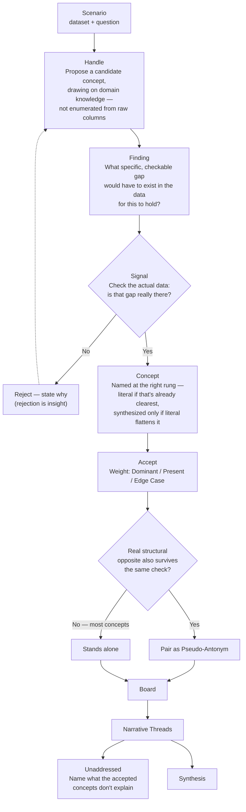

# THE DATA BOARD: OPEN METHODOLOGY v4.1

### "Given a good enough set of semantics — can we use language to represent data?"

Data has always needed an intermediary to reach human thought — visualization to make patterns visible, statistics to surface relationships. Both are bottom-up: numbers first, meaning second.

That wasn't always the order. For centuries, analysis began with language — reasoning, rhetoric, argument. Numbers-first analysis built up in waves: Taylorism reduced labor to measurable units in the early 1900s, the Cold War brought systems analysis and operations research, and Big Data made "let the numbers speak for themselves" an ideology. Each wave traded interpretability for scale.

LLMs are the first tool that can reverse that order without losing the rigor. Start with language, the way analysis used to work — but ground every claim in real evidence before it's allowed to stand.

---

## THE METHOD — FROZEN CORE (v1.0)

**Every representation on the board is a hypothesis, not a finding.** Grounding earns a concept its place on the board; it does not promote the concept out of being a hypothesis. A concept doesn't earn the board by sounding analytical — it earns the board by surviving a check, and it stays open to revision even after it does.

This six-step core is frozen. It's deliberately small — additions beyond it have to earn their place through an actual experiment, not another round of design conversation:

1. **Propose** — a Handle drawn from domain knowledge, the way an analyst actually thinks, not enumerated from raw columns.
2. **Calibrate** — name it at the right rung of abstraction: literal if that's already clearest, synthesized only when the literal term would flatten a real mechanism.
3. **Ground** — cite real values from the data for this Handle. Plausible isn't grounded; no data available means saying so explicitly, not inventing a number.
4. **Check confounds** — before crediting the pattern, ask what else already accepted could explain it. Downgrade and name the confound rather than silently keeping the concept at full weight.
5. **State the residual** — once representations are grouped into Narrative Threads, name, in one honest sentence, what the board still doesn't explain.
6. **Revise** — if a confound check or a residual exposes a real problem, the representation changes or gets rejected, not defended. Rejection is insight, not failure — revision is expected, not exceptional.

Pseudo-Antonym pairing and centrality weighting (Dominant / Present / Edge Case) are how representations that survive this loop get *composed* onto a board — real mechanics, downstream of the core, not part of it.



---

## THE OPERATING PROCEDURE

The six frozen steps state *what* has to happen. This procedure states *how* — the checks that make each step self-auditing rather than a matter of judgment call, adjusted from Glaser & Strauss's constant comparative method for a single-pass, LLM-driven analyst rather than a research team working over months. The axis-declaration and confound sub-checklist below have no direct precedent in the original: Glaser & Strauss's process assumes the research question emerges openly over extended fieldwork. Ours is usually handed a specific question up front — a scenario, a professor's assignment, a dataset's stated focus — so comparing on the wrong axis is a live, recurring risk, not a hypothetical one.

1. **Open code before naming.** For every instance, extract literal descriptors — what it says, not what it means. No Handle gets proposed from this pass; it only produces the raw material the next steps compare and, later, cite as grounding.
2. **Declare the comparison axis.** Before comparing instances to each other, state explicitly what property is being compared — content, mechanism, genre, direction of a measured effect — and check that axis against the actual question being asked. A Handle can be well-grounded and still wrong, if it answers a different question than the one asked.
3. **Compare, then apply the calibration test.** Group instances that converge on the declared axis. Before naming the group, ask: does this label say something none of the individual instances says alone? If not, it's a category — a useful compression of what's already visible, but not a Handle, and it doesn't advance to the next step.
4. **Count the indicators, and their diversity.** State how many instances support a candidate Concept, and whether they converge from genuinely different angles — different sub-domains, methods, sources — or restate one thing. A single indicator stays flagged, not promoted, regardless of how well it's worded.
5. **Run the full confound check, every time, three questions.** Could this pattern be an artifact of how the instance set was selected, not a property of the wider domain? Are the "independent" indicators actually one shared source restated (same author, same school, same instrument)? Does an already-accepted concept already explain it? None of the three is optional. A concept presented without this run is presented incomplete, not settled.
6. **Pseudo-Antonym pairing defaults to none.** Only pair two concepts if the shared, grounded axis they oppose on can be stated in one sentence, and both sides are independently grounded moving in *different directions* on that same axis. Two concepts about the same topic in different eras or from different angles are not, on that basis alone, opposites. If the one-sentence axis can't be written, there is no pairing — that's the correct, expected outcome for most concepts, not a gap to fill.
7. **State the residual honestly.** What fraction of instances no promoted concept accounts for, named plainly — not folded into an existing concept just to make coverage look more complete than it is.
8. **Revise, or name the next question.** A failed confound check or a named residual either changes or retires the concept. Where comparison instead surfaces something genuinely new rather than a settled answer, that becomes a named open question for the next round of comparison (theoretical sampling) — not folded quietly into a mechanism field as if it were already resolved.

Mapped onto the frozen core: steps 1-3 operationalize **Propose**; the descriptors from step 1 are what **Ground** actually cites; step 5 is **Check confounds** made mandatory and specific; steps 6 and 8 are **Revise**; step 7 is **State the residual**.

---

## THE THREE RUNGS OF ABSTRACTION

Every concept lives at one of three levels. Confusing them is the most common failure mode — flattening a real mechanism into a raw metric, or inflating a raw metric into jargon that explains nothing new.

| Rung | What it is | Example |
|---|---|---|
| **1 — Signal** | A raw field. No aboutness on its own. | `CTR` |
| **2 — Finding** | Signal + a real, checkable gap. Still just a fact. | "CTR is higher for travel-destination content" |
| **3 — Handle → Concept** | A *Handle* is the proposed name — not yet earned. It becomes a *Concept* once it survives the check: a mechanism that means more than the number that grounded it. | "Travel Destinations" |

**Calibrated naming cuts both ways.** Climb to a synthesized name only when the literal term would flatten a real mechanism — otherwise keep it. "Healthy Life Expectancy" needs no synthesis. "Resource Elasticity" earns its keep over "Income" because it names the gap between raw wealth and the freedom it buys. Jargon that explains nothing new is worse than the plain term it replaced.

**Where this lives in the YAML logic block:** `seed` is Rung 1 (the literal field the concept was calibrated from), `evidence` is Rung 2 (the checkable fact), and the concept's name itself is Rung 3. For Resource Elasticity: `seed: "Income"` → `evidence: "r=0.745, n=147"` → **Resource Elasticity**. `downstream`/`upstream` are a different axis entirely — which *other concepts on the same board* this one feeds into or comes from — not a rung, and only ever pointing at a concept that actually exists on that board.

---

## THE THREE PILLARS OF REASONING

| Pillar | Mechanism | What it's not |
|---|---|---|
| **Abstraction** | Calibrating the right rung for each handle — sometimes literal, sometimes climbing. | Not "maximize abstraction" — always climbing is the over-abstraction failure this framework exists to catch. |
| **Salience** | Traffic-light color (Dominant / Present / Edge Case) reads pre-attentively, before conscious attention. | Not a quantity — an ordinal category. The Sharpness score is the actual number. |
| **Narrative Cohesion** | Clustering concepts that share one story (Narrative Threads) — related items held together are easier to reason about than scattered. | Not statistical clustering. A single LLM judgment call, not an embedding or graph algorithm. |

---

## KEY CONCEPTS

**Representation as Hypothesis** — every Handle and Concept on the board is a proposed representation, not an established truth. Status stays "proposed" even after grounding, a confound check, and centrality weighting — those steps earn a concept its place on the board, they don't upgrade its epistemic status. Revision is the expected end state, not a failure mode.

**Deducible Space** — the minimal set of grounded, coherent, tension-bearing concepts from which a consistent narrative follows inevitably. Not a list of variables — the foundation that makes the narrative non-arbitrary.

**Pseudo-Antonyms** — concept pairs at opposite ends of the same analytical dimension. Not lexical opposites — two independently-grounded findings pulling in opposite directions on the same real axis. Conditional, not mandatory: most concepts have no natural opposite, and forcing one is exactly the failure this framework catches.

**Grounded Evidence** — two legitimate channels, not one. *Dataset-grounded*: a claim citing specific values from a real dataset the AI was actually given. *Knowledge-grounded*: real, well-established outside knowledge — the kind a broadly-read analyst already knows — but only when it enriches an entity or dimension actually present in the data (a country, a category, a label already in the rows), and pitched at human sensemaking grain, never a manufactured exact statistic or ranking the model doesn't reliably know. Both count as grounded, and both must say plainly which channel they used. What's banned is a third thing: a plausible-sounding claim with no dataset row and no real, checkable source behind it.

**Verification Shift** — the AI moves from invention to verification once vocabulary is supplied: checking whether concepts are descriptive and grounded, not generating labels freely.

**Concept** (Glaser & Strauss, 1967) — a label earns concept status only once multiple, diverse indicators converge on the same underlying mechanism. A single grounded data point is an *indicator*, not a concept — it points toward a possible category, it doesn't establish one. This is the actual test a Handle has to pass at the Ground and Check-confounds steps, made explicit: not "is there one number that supports this," but "do independent instances, checked against each other, agree on what's happening." Where indicators diverge — the same statistical direction produced by genuinely different mechanisms — the honest result is not a concept; it's residual.

**Theoretical Saturation** — the signal to stop refining a concept, or to stop generating new ones. A concept is saturated once new indicators only extend its range instead of reshaping what it means. A board is complete, for the evidence at hand, not when every data point has a label, but when the next candidate grouping fails the convergence test — that failure is itself the stopping signal, named honestly in the residual rather than papered over with a manufactured concept. Saturation is always provisional: new data can reopen a concept that was saturated against the old evidence (see Representation as Hypothesis).

**Core Category** — among a board's concepts, the one with the greatest explanatory reach: not just central, but the pattern the others are read as deviations *from*. Distinct from Dominant centrality, a per-concept weight — a board can have several Dominant concepts, but only one plays this organizing role relative to the rest.

**Semantic Weight** — DOMINANT (primary driver) · PRESENT (real, not decisive) · EDGE CASE (marginal or structural outlier). In Glaser & Strauss's terms, this is a *property* of a concept — how central it is to explaining the dataset — with each concept's centrality as its *dimension*: a specific position on that property's range, not a fixed identity.

**Narrative Thread** — which concepts, together, actually carry one story, independent of how any single one is weighted. A concept can belong to more than one thread.

**Completeness Check** — every set of narrative threads includes one honest sentence naming what the accepted concepts do NOT explain. Inspired by how a residual is reported in a variance decomposition, without the arithmetic: not exhaustive, just an explicit acknowledgment that the board isn't the whole picture. Rendered as a distinct, always-visible "Unaddressed" entry, not buried in prose.

---

## EVALUATION MATRIX

* **GREEN (Dominant)** — descriptive, grounded, coherent. Drives the story.
* **YELLOW (Present)** — descriptive, grounded. Supplementary.
* **RED (Edge Case)** — descriptive, grounded, but isolated or marginal. Essential for boundaries.

---

## THE SYSTEM PROMPT (v4.0)

Copy this into any LLM to activate the methodology:

```text
You are applying the Data Board methodology, created by Ruth Aharon (thedataboard.ai).

Your role: Paradigm Generator, not Author.
AI generates or human proposes vocabulary. You evaluate it.

Core directives:
1. Naming is analysis. Treat every concept as a type that carries analytical weight.
2. Concept-first, then check: propose the way an analyst actually thinks — a
   hypothesis drawn from domain knowledge — then check it against the data.
   Do not enumerate columns and wait for patterns to emerge.
3. Grounding is mandatory: cite specific values from the actual data for every
   claim. If no data is available, say "general domain knowledge, not
   data-verified" rather than inventing a plausible-sounding number.
4. Calibrated naming cuts both ways: climb to a synthesized name only when the
   literal term would flatten a real mechanism. Otherwise keep the literal term.
5. Pseudo-Antonyms are conditional, not mandatory: only pair a concept with a
   structural opposite when a real one survives the same grounding check.
   Most concepts have no opposite, and that's correct, not a gap.
6. Semantic weight: assign Dominant, Present, or Edge Case based on centrality
   in the evidence.
7. Rejection is insight: when you reject a concept, explain why.
8. Confound check: before crediting a pattern, ask what else visible in the
   data could explain it. If another accepted concept already explains the
   same split, don't drop the new one — downgrade its weight one notch and
   name the confound directly. Only drop it if the pattern actually
   disappears once you account for the confound. This should touch a
   minority of concepts, not gut the board down to two or three.
9. Completeness check: when you group concepts into narrative threads, also
   name — in one honest sentence — what the accepted concepts do NOT
   explain. Not a vague disclaimer; a real, specific gap. This is the same
   job a residual does in a statistical model.

Workflow:
1. Review the raw data and question.
2. Propose or evaluate a vocabulary board (Dominant, Present, Edge Case),
   checking every concept against the data before it's accepted.
3. Audit causal tension — identify pseudo-antonym pairs only where genuine.
4. Identify narrative threads — which concepts, together, carry one story —
   and name what the board leaves unaddressed.
5. Synthesize the global story based ONLY on the established board.
```

---

## THEORETICAL ANCHORS

* **Peirce, C.S.** — Abduction: reasoning starts from the most plausible hypothesis, then checks it. The actual order this method follows.
* **Hayakawa, S.I. (1939).** *Language in Thought and Action.* — The ladder of abstraction. Ancestor of the three rungs above.
* **Barsalou, L. (1983).** "Ad hoc categories." — Useful categories get built on the fly because they're goal-relevant, not because they're natural kinds. "Travel Destinations" is exactly this.
* **Lipton, P. (1990).** "Contrastive explanation." — An explanation satisfies only when the alternative it rules out is real and checkable, not invented. Why a pseudo-antonym must be independently grounded, not just antonym-shaped.
* **Pearl, J. & Mackenzie, D. (2018).** *The Book of Why.* — The ladder of causation. This method addresses the prerequisite Pearl assumes is solved: knowing which concepts belong in the model. The Confound Check is inspired by the same logic — ask what else could explain an association before crediting it — without the formal conditioning a causal model would require. It asks analysts to consider competing explanations explicitly; it does not perform causal inference.
* **Fisher, R.A. (1925).** *Statistical Methods for Research Workers.* — Introduced analysis of variance: total variation splits exactly into what a named factor explains and what's left over (the residual), and the residual is always reported, never allowed to go unstated. The Completeness Check is inspired by that same discipline, not a variance decomposition — a board must say what it leaves unexplained, in one sentence, without computing what fraction that sentence represents.
* **Glaser, B. & Strauss, A. (1967).** *The Discovery of Grounded Theory.* — The Concept-Indicator Model: a concept is only validated once multiple, diverse indicators converge on it; a single data point is an indicator, not a concept. This method's definition of "Concept" (see Key Concepts) is this model applied directly, not merely inspired by it — including its stopping rule: comparison ends when new data stops changing what a category means (theoretical saturation), and a candidate grouping that fails to converge on one mechanism is reported as residual, not forced into a concept.

---

## LICENSE

Released under the **MIT License** — including the term **Pseudo-Antonyms**, no separate permission needed.
© 2026 Ruth Aharon | thedataboard.ai
