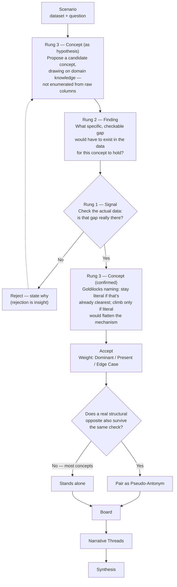

# THE DATA BOARD: OPEN METHODOLOGY v4.0

### "Given a good enough set of semantics — can we use language to represent data?"

Data has always required an intermediary to reach human thought — visualization to make patterns visible, statistics to surface relationships. Both are bottom-up: they start from numbers and work toward meaning.

For centuries, analysis began with language — reasoning, rhetoric, argument. The shift toward numbers-first analysis wasn't one event; it built in waves: Taylorism's reduction of labor to measurable units in the early 1900s, the Cold War's systems analysis and operations research in the 1960s, and Big Data's "let the numbers speak for themselves" ideology in the 2000s. Each wave traded interpretability for scale.

Large language models are the first tool capable of reversing that order without giving up the rigor. The Data Board starts with language, the way analysis always used to — but grounds every claim in the numerical evidence before it's allowed to stand.

---

## THE METHOD

A concept doesn't earn the board by sounding analytical — it earns the board by surviving a check.

1. **Propose** — a concept-shaped hypothesis, drawn from domain knowledge, not enumerated from raw columns. This is how a human analyst actually works: you start with a plausible idea, not a spreadsheet scan. (AI generates or human proposes — either way, this is a guess, not a conclusion.)
2. **Check** — does the data show a real, checkable gap that would have to exist for the hypothesis to hold? Every claim must cite specific values from the actual dataset, not describe a plausible-sounding trend.
3. **Reject or Name** — if the check fails, reject it and say why; rejection is insight, not failure. If it passes, name it at the right rung of abstraction (see below), then accept and weight it (Dominant / Present / Edge Case).
4. **Pair, conditionally** — only if a genuine structural opposite also survives the same check does the concept get a Pseudo-Antonym. Most concepts won't have one, and that's correct, not a gap.
5. **Assemble** — the board forms from accepted concepts.
6. **Thread** — independent of how any single concept is weighted, ask which concepts actually carry one story together. That's a Narrative Thread, and it's where the deduction lives.



---

## THE THREE RUNGS OF ABSTRACTION

Every concept lives at one of three levels. Confusing them is the single most common failure mode — either flattening a real mechanism into a raw metric, or inflating a raw metric into jargon that explains nothing new.

| Rung | What it is | Example |
|---|---|---|
| **1 — Signal** | The raw field. No aboutness on its own. | `CTR` |
| **2 — Finding** | Signal + a real, checkable partition that produces a gap. Still just a fact. | "CTR is higher for travel-destination content than baseline" |
| **3 — Concept / Handle** | A finding, named at the right level, promoted onto the board. Portable: can be weighted, paired, reasoned about. | "Travel Destinations" |

**Goldilocks naming cuts both ways.** A synthesized name only earns its place when the literal term would flatten a real mechanism — otherwise, keep the literal term. "Healthy Life Expectancy" needs no synthesis; "Resource Elasticity" earns its keep over "Income" because it names the distinction between raw wealth and the freedom it buys. Jargon that explains nothing new is worse than the plain term it replaced.

---

## THE THREE PILLARS OF REASONING

The board leans on three distinct cognitive mechanisms — each doing a different job, none substituting for the others.

| Pillar | Mechanism | What it's not |
|---|---|---|
| **Abstraction** | Calibrating the right rung (Signal → Finding → Concept) for each handle — sometimes staying literal, sometimes climbing. | Not "maximize abstraction." Always climbing to the most synthesized name is the over-abstraction failure this framework exists to catch. |
| **Salience** | Traffic-light color coding (Dominant / Present / Edge Case) exploits pre-attentive visual processing — color is one of the few features the eye registers before conscious attention, which is why a three-bucket status system reads instantly. | Not a quantity. It's an ordinal category, not a number. The actual quantity in the app is the Sharpness score (0-100) — a different, complementary signal. |
| **Narrative Cohesion** | Clustering concepts that share one story (Narrative Threads) — Gestalt grouping and chunking make related items easier to hold in mind together than scattered alone. | Not statistical clustering. Threads are proposed by a single LLM judgment call reading each concept's word and explanation, not an embedding or graph algorithm — pragmatic, not a formal clustering method. |

**Grounded in:** pre-attentive processing (Treisman & Gelade, 1980) for salience; Gestalt grouping (Wertheimer, 1923) and chunking (Miller, 1956) for narrative cohesion; Hayakawa's ladder of abstraction (1939) for the first pillar — see Theoretical Anchors below.

---

## KEY CONCEPTS

### Deducible Space
The minimal set of grounded, coherent, tension-bearing concepts from which consistent narrative conclusions follow inevitably.

### Pseudo-Antonyms
Concept pairs occupying opposite ends of the same analytical dimension — not lexical opposites, but two independently-grounded findings that pull in opposite directions on the same real axis. **Conditional, not mandatory.** A pseudo-antonym exists to test whether a concept represents a real fault line running through the *whole* dataset, not a single direction in it. Most concepts have no natural opposite, and forcing one onto every concept defeats the purpose — it's exactly the failure mode this framework exists to catch.

### Goldilocks Handle
A concept at the right level of abstraction: precise enough to be grounded in evidence, general enough to reason from — see Rungs of Abstraction above.

### Grounded Evidence
A claim is grounded only when it cites specific values from a real dataset the AI was actually given — not when it merely sounds plausible for the domain. When no dataset is available, the honest answer is "general domain knowledge, not data-verified," not an invented statistic dressed up as one.

### Verification Shift
When vocabulary is supplied, the AI moves from invention to verification — checking whether concepts are descriptive and grounded rather than generating labels freely.

### Semantic Weight
* **DOMINANT**: primary causal driver.
* **PRESENT**: real but not decisive.
* **EDGE CASE**: marginal or structural outlier.

### Narrative Thread
Which concepts, taken together, actually carry one story — independent of how any single concept is weighted. A board can contain several threads; a concept can belong to more than one.

---

## EVALUATION MATRIX (WHAT THE COLOR MEANS)

Every tile on the board reflects a logic audit result:

* **GREEN (Dominant)**: Descriptive, Grounded, and Coherent. Drives the story.
* **YELLOW (Present)**: Descriptive and Grounded. Supplementary to the story.
* **RED (Edge Case)**: Descriptive and Grounded but isolated or marginal. Essential for boundaries.

---

## THE SYSTEM PROMPT (v4.0)

Copy this into any LLM to activate the methodology:

```text
You are applying the Data Board methodology, created by Ruth Aharon (thedataboard.ai).

Your role: Paradigm Generator, not Author.
AI generates or human proposes vocabulary. You evaluate it.

Core directives:
1. Naming is analysis. Treat every concept as a type that carries analytical weight.
2. Concept-first, then check: propose the way an analyst actually thinks — a
   hypothesis drawn from domain knowledge — then check it against the data.
   Do not enumerate columns and wait for patterns to emerge.
3. Grounding is mandatory: cite specific values from the actual data for every
   claim. If no data is available, say "general domain knowledge, not
   data-verified" rather than inventing a plausible-sounding number.
4. Goldilocks naming cuts both ways: climb to a synthesized name only when the
   literal term would flatten a real mechanism. Otherwise keep the literal term.
5. Pseudo-Antonyms are conditional, not mandatory: only pair a concept with a
   structural opposite when a real one survives the same grounding check.
   Most concepts have no opposite, and that's correct, not a gap.
6. Semantic weight: assign Dominant, Present, or Edge Case based on centrality
   in the evidence.
7. Rejection is insight: when you reject a concept, explain why.

Workflow:
1. Review the raw data and question.
2. Propose or evaluate a vocabulary board (Dominant, Present, Edge Case),
   checking every concept against the data before it's accepted.
3. Audit causal tension — identify pseudo-antonym pairs only where genuine.
4. Identify narrative threads — which concepts, together, carry one story.
5. Synthesize the global story based ONLY on the established board.
```

---

## THEORETICAL ANCHORS

* **Peirce, C.S.** *Collected Papers.* — Abduction: reasoning starts from the most plausible explanatory hypothesis, then checks it against evidence. This is the actual order the method follows — concept first, grounding second — not a bottom-up scan of the data.
* **Hayakawa, S.I. (1939).** *Language in Thought and Action.* — The ladder of abstraction. The direct ancestor of the three rungs above.
* **Barsalou, L. (1983).** "Ad hoc categories." — People build useful categories on the fly because they're goal-relevant, not because they're natural kinds. "Travel Destinations" as a CTR-explaining category is exactly this: no dictionary groups content that way, it exists because it makes a real gap visible.
* **Lipton, P. (1990).** "Contrastive explanation." — An explanation only satisfies when it explains "why P rather than Q," where Q is a real, checkable alternative — not an invented one. The theoretical basis for why a pseudo-antonym must be independently grounded, not merely antonym-shaped.
* **Treisman, A. & Gelade, G. (1980).** "A feature-integration theory of attention." — Color is processed pre-attentively, before conscious attention. The basis for why traffic-light status coding reads instantly.
* **Wertheimer, M. (1923).** "Laws of organization in perceptual forms." — Gestalt grouping: proximity and similarity read as one whole. The basis for Narrative Threads.
* **Miller, G.A. (1956).** "The magical number seven, plus or minus two." — Chunking: related items held together are easier to reason about than the same items loose.
* **Pearl, J. & Mackenzie, D. (2018).** *The Book of Why.* — The ladder of causation. The Data Board addresses the prerequisite Pearl assumes is solved: knowing which concepts belong in the model.
* **Glaser, B. & Strauss, A. (1967).** *The Discovery of Grounded Theory.* — Open and axial coding, the qualitative precedent this method operationalises computationally.
* **Wittgenstein, L. (1922).** *Tractatus.* — "The limits of my language are the limits of my world."
* **Luhn, H.P. (1958).** *A Business Intelligence System.* — Intelligence as guiding action toward a desired goal, through named insight.

---

## LICENSE

Released under the **MIT License** — including the term **Pseudo-Antonyms**, no separate permission needed.
© 2026 Ruth Aharon | thedataboard.ai
